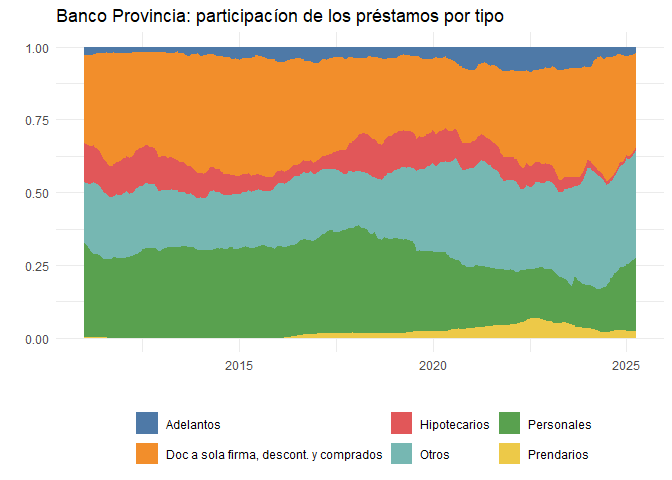

# Datos del Banco Central de la República Argentina (BCRA) y la Comisión Nacional de Valores (CNV)

<br>

**NO OFICIAL: el paquete no es un producto oficial**

## Descripción

Este paquete permite acceder a algunos de los datos publicados por el
Banco Central de la República Argentina (BCRA) y Comisión Nacional de
Valores (CNV) y trabajar con ellos en el entorno de R.

Al momento se pueden consultar los siguientes datos:

- Indicadores de entidades financieras desde enero 2011 a abril 2025
  (BCRA).
- Balance resumido de entidades financieras desde enero 2011 a abril
  2025 (BCRA).
- Balance detallado de entidades financieras desde enero 2011 a abril
  2025 (BCRA).
- Unidades de servicio de entidades financieras históricas (BCRA).
- Emisión de Obligaciones Negociables desde 2015 (CNV).
- Emisión de fideicomisos financieros desde 2015 (CNV).

El paquete incluye estos datos como dataframes a los cuales se puede
acceder directamente al cargar el paquete (*excepto balance detallado,
que por su tamaño se descarga en el momento*). Además, se incluye un
conjunto de funciones para acceder a los datos de manera personalizada.

## Instalación

Para instalar el paquete, correr el siguiente código

``` r
# install.packages('devtools')
# si no tiene instalado devtools

devtools::install_github("jurricariet/finARG")
```

## Modo de uso

Se puede acceder a los datos a partir de las funciones `get_...()`

- `get_uniser()`: Permite filtrar por entidad para obtener sucursales,
  casas matrices y otros tipos de unidad por fecha de alta/baja y
  ubicacion geografica.

- `get_indicadores()`: Filtra el dataset de indicadores financieros
  publicado por el BCRA por periodos seleccionados, entidad (por nombre
  o codigo) e indicador (por codigo).

- `get_balres()`: Filtra el dataset de balance resumido publicado por el
  BCRA por periodos seleccionados, entidad (por nombre o codigo) e
  indicador (por codigo).

- `get_baldet()`: Descarga el balance detallado de entidades de acuerdo
  a los períodos especificados (demora para períodos extensos).

- `get_cnv()`: Series estadísticas de emisiones de Obligaciones
  Negociables o Fideicomisos financieros de la CNV.

Se pueden cargar los distintos dataframes completos directamente

- Unidades de servicio: `uniser`
- Indicadores financieros: `indicadores_bancos`
- Balance resumido: `balres`
- Emisión de Obligaciones Negociables (ONs): `on_cnv`
- Emisión de fideicomisos financieros: `fideicomisos_financieros_cnv`
- Balance detallado: `get_baldet()` *En este caso, realiza la descarga
  en el momento*

``` r
# Cargo la libreria
library(finARG)

head(balres)
#>   codigo_de_entidad    nombre_de_entidad  fecha codigo_de_linea
#> 1             00005 ABN  AMRO BANK N. V. 201101    100010000000
#> 2             00005 ABN  AMRO BANK N. V. 201101    100010100000
#> 3             00005 ABN  AMRO BANK N. V. 201101    100010200000
#> 4             00005 ABN  AMRO BANK N. V. 201101    100010300000
#> 5             00005 ABN  AMRO BANK N. V. 201101    100010301000
#> 6             00005 ABN  AMRO BANK N. V. 201101    100010302000
#>      denominacion_de_la_cuenta  valor
#> 1                  A C T I V O 202201
#> 2             Disponibilidades   2128
#> 3  Títulos Públicos y Privados  91215
#> 4                    Préstamos  32885
#> 5 Sector Público no Financiero      0
#> 6            Sector Financiero  20005
```

Para tener un listado de códigos de las entidades del BCRA puede usarse
la función `entidades_codigos()`

``` r
head(entidades_codigos())
#> # A tibble: 6 × 2
#>   codigo_de_entidad nombre_de_entidad                    
#>   <chr>             <chr>                                
#> 1 00005             ABN  AMRO BANK N. V.                 
#> 2 00007             BANCO DE GALICIA Y BUENOS AIRES S.A. 
#> 3 00011             BANCO DE LA NACION ARGENTINA         
#> 4 00014             BANCO DE LA PROVINCIA DE BUENOS AIRES
#> 5 00015             STANDARD BANK ARGENTINA S.A.         
#> 6 00016             CITIBANK N.A.
```

Para un listado de códigos de indicadores financieros usar
`indicadores_codigos()`

``` r
head(indicadores_codigos())
#> # A tibble: 6 × 2
#>   codigo_de_linea descripcion_del_indicador                                   
#>             <dbl> <chr>                                                       
#> 1    800010100080 C8 - Patrimonio Neto sobre activos neteados (apalancamiento)
#> 2    800010200020 A2 - Incobrabilidad potencial                               
#> 3    800010200030 A3 - Cartera vencida                                        
#> 4    800010200040 A4 - Previsiones sobre cartera irregular                    
#> 5    800010200050 A5 - Previsiones constituidas sobre mínimas exigibles       
#> 6    800010200100 A10 - Cartera irregular sobre financiaciones
```

Para un listado de códigos de cuentas del balance resumido:
`balres_codigos()`

``` r
head(balres_codigos())
#> # A tibble: 6 × 2
#>   codigo_de_linea denominacion_de_la_cuenta   
#>             <dbl> <chr>                       
#> 1    100010000000 A C T I V O                 
#> 2    100010100000 Disponibilidades            
#> 3    100010200000 Títulos Públicos y Privados 
#> 4    100010300000 Préstamos                   
#> 5    100010301000 Sector Público no Financiero
#> 6    100010302000 Sector Financiero
```

## Actualización de los datos

Para chequear actualizaciones de los respectivos archivos y
descargarlas, se pueden correr funciones individuales para cada fuente o
correr `update_data()` para correrlas todas juntas. Según el caso,
chequea si hay nuevos datos y los agrega a los archivos respectivos
alojados en el paquete.

Las funciones son:

- `update_uniser()`: Descarga el excel de unidades de servico del BCRA
  y, si tiene cambios respecto al del paquete, lo reemplaza.
- `update_balres()`: Verifica si hay archivo del BCRA correspondiente a
  un mes posterior al último y lo agrega en caso afirmativo.
- `update_indicadores()`: Verifica si hay archivo del BCRA
  correspondiente a un mes posterior al último y lo agrega en caso
  afirmativo.
- `update_cnv()`: Descarga los excels de la página de CNV y, si tiene
  cambios respecto al del paquete, los reemplaza.
- `update_data()`: Corre todas las funciones anteriores para actualizar
  todas las fuentes.

## Ejemplo de uso:

``` r
prestamos_provincia <- get_balres(periodos = c('2011-01','2025-04'),
                                  codigo_entidad = '00014',
                                  codigo_cuenta = c('100010303001','100010303005','100010303010','100010303015','100010303020','100010303030')) 
```

Puede verse en este gráfico la participación de cada tipo de préstamo en
el activo del Banco Provincia.

``` r
library(tidyverse)
#> ── Attaching core tidyverse packages ──────────────────────── tidyverse 2.0.0 ──
#> ✔ dplyr     1.1.4     ✔ readr     2.1.5
#> ✔ forcats   1.0.0     ✔ stringr   1.5.1
#> ✔ ggplot2   3.5.2     ✔ tibble    3.3.0
#> ✔ lubridate 1.9.4     ✔ tidyr     1.3.1
#> ✔ purrr     1.0.4     
#> ── Conflicts ────────────────────────────────────────── tidyverse_conflicts() ──
#> ✖ dplyr::filter() masks stats::filter()
#> ✖ dplyr::lag()    masks stats::lag()
#> ℹ Use the conflicted package (<http://conflicted.r-lib.org/>) to force all conflicts to become errors
prestamos_provincia %>% 
 mutate(fecha = ym(fecha)) %>% 
  ggplot(aes(x=fecha,y=valor,group=denominacion_de_la_cuenta,fill=denominacion_de_la_cuenta))+
  geom_area(position =  position_fill())+
  theme_minimal()+
  theme(legend.position = 'bottom')+
  ggthemes::scale_fill_tableau(name='')+
  labs(x='',y='',title='Banco Provincia: participacíon de los préstamos por tipo')
```


